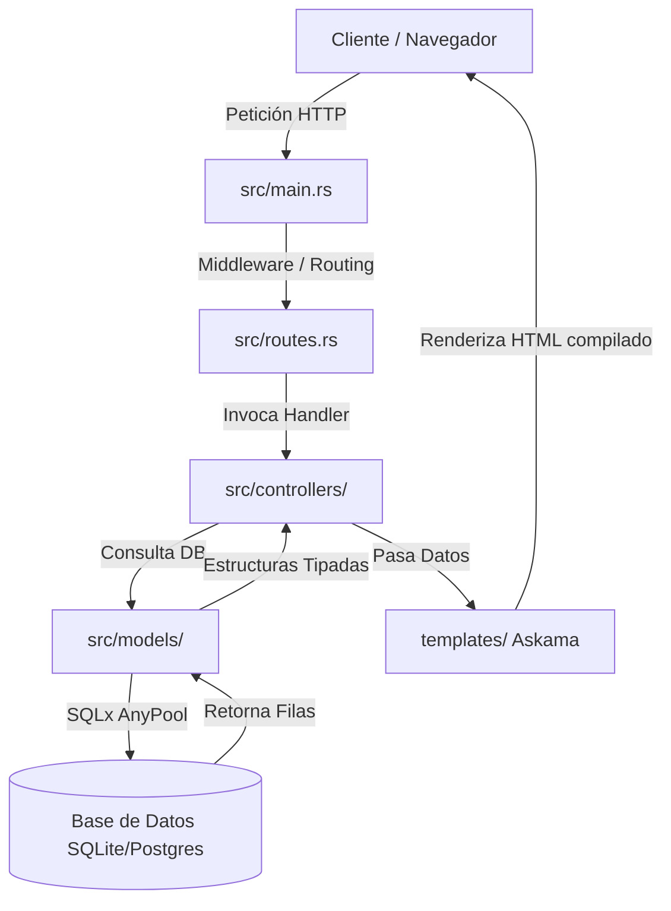

# Arquitectura del Sistema: Larust 🦀

Larust implementa una arquitectura monolítica limpia basada en el patrón clásico **Modelo-Vista-Controlador (MVC)**, adaptado a la concurrencia segura y tipado estricto de Rust.

El objetivo principal es mantener un desacoplamiento claro entre la capa de presentación (vistas), la lógica de negocio (controladores) y la capa de acceso a datos (modelos).

---

## 🗺️ Ciclo de Vida de una Petición (Request Lifecycle)

El flujo que sigue una petición HTTP desde que entra en el servidor hasta que el cliente recibe la respuesta se detalla a continuación:



1. **Entrada (`src/main.rs`)**: El servidor HTTP Axum configurado sobre el runtime asíncrono Tokio escucha las peticiones en el puerto especificado. Carga la configuración inicial de las variables de entorno (`.env`) e inicializa el Pool de conexiones a base de datos (`sqlx::AnyPool`).
2. **Enrutamiento (`src/routes.rs`)**: La petición pasa a través de las rutas definidas. Aquí se definen y segmentan los endpoints en rutas web (vistas HTML) y rutas de API (generalmente llamadas dinámicas por HTMX).
3. **Controlador (`src/controllers/`)**: El controlador correspondiente extrae los parámetros (Query, Path, Form o State) y ejecuta la lógica de negocio.
4. **Modelo (`src/models/`)**: Si es necesario, el controlador utiliza modelos de datos que consultan a la base de datos de manera asíncrona mediante SQLx.
5. **Vista (`templates/`)**: Los datos del controlador se inyectan en estructuras de plantillas (Askama). Askama compila estas plantillas directamente en código de Rust para lograr un rendimiento de renderizado inigualable y verificar la sintaxis en tiempo de compilación.
6. **Respuesta**: El HTML resultante se envía de vuelta al cliente. Si la petición provino de **HTMX**, se retorna un fragmento HTML para actualizar una sección específica del DOM sin refrescar la página.

---

## 💾 Gestión de Estado Global (State Management)

Axum utiliza un sistema de tipos para inyectar estados de forma segura en los controladores. En Larust, el pool de conexiones de base de datos se inyecta utilizando `.with_state(pool)` en el enrutador raíz:

```rust
// Inyección en src/main.rs
let app = Router::new()
    .merge(routes::web_routes())
    .with_state(pool);
```

Cualquier controlador que requiera acceso a la base de datos simplemente declara el extractor `State` en sus parámetros:

```rust
// Extracción en src/controllers/user_controller.rs
pub async fn index(State(db): State<AnyPool>) -> impl IntoResponse { ... }
```

---

## 🎨 Frontend Híbrido (HTMX + Tailwind CSS)

En lugar de construir una API REST y un cliente SPA separado (React, Vue, etc.), Larust promueve un enfoque monolítico moderno:
- **Tailwind CSS CLI** compila las clases CSS directamente analizando los archivos HTML en `templates/`.
- **HTMX** intercepta los eventos del navegador (clicks, envíos de formularios, cambios de inputs) y realiza peticiones AJAX transparentes al servidor, inyectando el HTML retornado directamente en el contenedor indicado sin recargar el sitio.
- Los archivos estáticos compilados y las librerías frontend (como `htmx.min.js`) son servidos eficientemente desde el directorio `static/` a través del servicio `ServeDir` de **Tower HTTP**.
